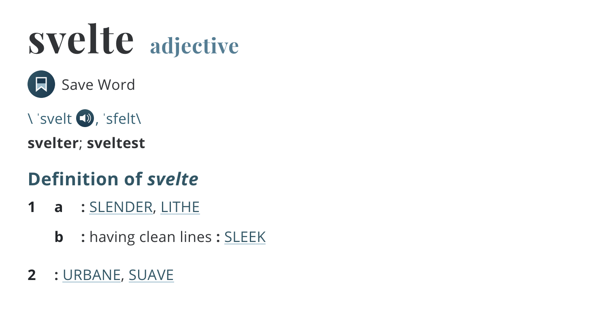
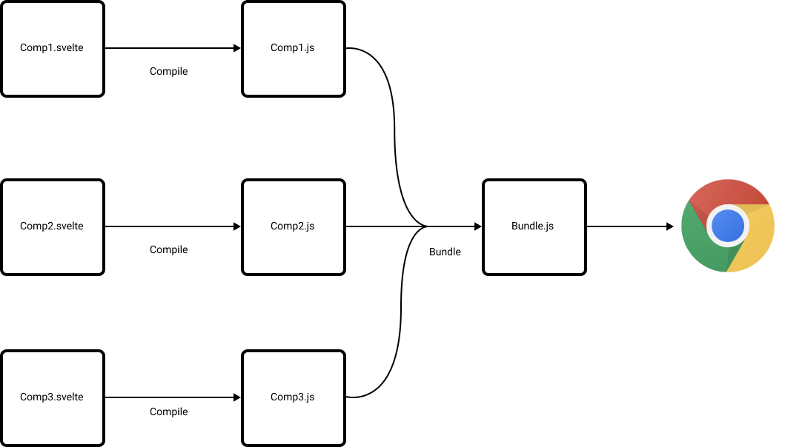
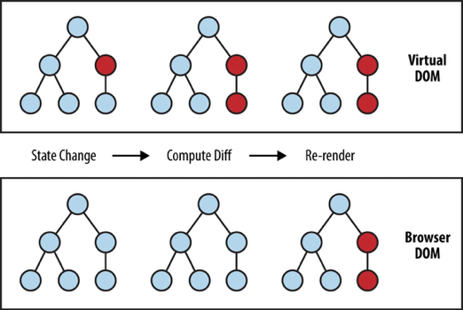

<a href="https://unsplash.com/@arisu_view?utm_source=unsplash&amp;utm_medium=referral&amp;utm_content=creditCopyText">
  
</a>

[Svelte 3.0](https://svelte.dev/blog/svelte-3-rethinking-reactivity) came out just a couple of months ago and received a lot of attention from the JS community. It got me interested in exploring the technology and I ended up doing a lightning talk on it at [my company](https://xebia.com/) during our bi-weekly knowledge sharing session, [the XKE](https://xebiatalent.com/our-culture).

To structure the talk I've written a 6 verse haiku, each verse represents a feature of Svelte during my research. Happy to share this with you today.

___

### Svelte Haiku

> Elegant and slender <br/>
> Compilation in its nature <br/>
> One word, reactive <br/>
> <br/>
> Share state simply <br/>
> No VDOM, yes performance <br/>
> Use for joy.<br/>

<br/>
Let's go through this haiku line by line and look into some of the features of Svelte.

___

### Elegant and slender

A quick search on the definition of Svelte returns the following:



It is very fitting when you look at the API design. The creators managed to make the written code light and concise. 

Here's an example of a Svelte component:

```js
// Counter.svelte
<script>
  let count = 0;
  
  function increment() {
    count = count + 1;
  }
</script>

<style>
  button {
    border: none;
  }
</style>

<button on:click={increment}>
  clicked {count} times
</button>
```

The `.svelte` file consists of three blocks:

1.   `<script>` block with JS
2.  `<style>` block with scoped CSS
3. `html` template with Svelte bindings

In this example we've declared a `count` variable. By declaring the variable it is made available in the html template. Incrementing the `count` is as simple as reassigning the `count` variable to a new value. The UI updates whenever a new value is assigned to a variable. 

This api is made possible because *Svelte operates on compilation step*, where *most JS frameworks do their work during run time*.

This essential difference gives Svelte creators more flexibility in their API design, allowing them to create a concise and easy to understand API.

___

### Compilation in its nature

At its core Svelte is a compiler. It turns `.svelte` components into `.js` files which a module bundler can then bundle together and include in the DOM. 

Here's a high level diagram on how this works:

<div class="center-image">
  
</div>

Being a compiler gives Svelte a number of advantages, mainly:

**API design flexibility** <br/>
Svelte API designers have more flexibility in designing a simple to use API for its users without sacrifising performance

**Minimal size** <br/>
Any unused modules can be tree shaken; leaving the minimum required amount of code to make it run. For example, if you don't use the animation module, this will not be included in your bundle.

**Performant** <br/>
The output is heavily tweaked for  performance

Being a compiler is a major differentiator from other JS frameworks like React, Vue or Angular.

___

### One word, reactive
Reactivity plays a major part in modern ui applications. Data fetches and user events often need to translate in UI updates.  

Svelte provides a easy way to develop reactive application by providing an elegant API for handling reactivity.  It boils down to the following:

> Use `$:` prefix to declare a reactive variable

Here's an example:

```js
<script>
  let count = 0;
  $: countPlusTwo = count + 2;

  function increment() {
    count++;
  }
</script>

<button on:click={increment}>
  {count} + 2 = {countPlusTwo}
</button>
```

By prepending `$:` before `countPlusTwo` we tell the framework this variable needs to be reactive. Every time `count` changes it knows to recompute `countPlusTwo` , updating the template.

If you've worked with RxJS this syntax feels very familiar. In RxJS we use the convention of appending `$` to observable streams, which are also reactive values. In Svelte the `$:` is prepended instead.

Although reactive variables are very easy to create, they are very powerful. Reactive values can be composed or chained together; creating streams that react to any changes in your application state.

___

### Share state simply

State management in a Svelte application can happen on two levels: local and shared.

Local state management is done in the component itself. For example declaring a variable in the `.svelte` component. Re-assigning a new value triggers a UI update. 

Shared state management is done using the `svelte/store` module. This module allows for the creation of stores which can be imported by one or multiple components in order to share state.

`svelte/store` provides three methods:

1. `writable()`
2. `readable()`
3. `derived()`

This is a good example for well named functions. `writable()` creates a writable store which components can read and write to. `readable()` makes for read-only store and `derived()` can be used for stores that are derived from existing writable or readable stores.  

Here's a short example for `writable`:

```js
// CounterStore.js
import {writable} from 'svelte/store';

export const count = writable(0);
```

```js
// CounterButton.svelte
<script>
  import { count } from  './CounterStore';

  function increment() {
    count.update(n => n + 1);
  }
</script>

<button on:click={{increment}}>
  Increment
</button>
```


```js
// CounterDisplay.svelte
<script>
  import { count } from  './CounterStore';
</script>

The current count is {$count}
```

Here we've created a writable store for the counter in order to share the state between the `CounterButton` and the `CounterDisplay`. If you look closely you see the imported `count` variable is referenced as `$count`.  This is actually a shorthand for the subscription:

```js
<script>
  import { count } from  './CounterStore';
  
  let _count;

  count.subscribe(c => {
    _count = c
  });
</script>

The current count is {count}
```

For a more extensive explanation check out the official [tutorial](https://svelte.dev/tutorial/writable-stores).

___

### No VDOM, yes performance

The major difference with other JS frameworks is that Svelte does not have a virtual DOM.

VDOM is a technique, introduced by React, of having a representation of the DOM in memory. Whenever the state changes a diff is done in memory and changes to the real DOM are patched.

<div class="center-image">
  
</div>

The big three front-end frameworks all make use of a VDOM and do the diffing in memory during runtime.

Svelte is different. It does not have a VDOM and avoids this work entirely. Being a compiler and having the developer declare the reactive variables, it can figure out during run time exactly which elements can change. These elements are marked in the outputted code and invalidated when properties change, resulting in a very efficient UI update.

**There is no need for VDOM.** 

By avoiding this work Svelte has best-in-class performance, all the while keeping a declaritive API.

Rich Harris, the creator of Svelte, wrote an excellent article on this: [https://svelte.dev/blog/virtual-dom-is-pure-overhead](https://svelte.dev/blog/virtual-dom-is-pure-overhead).

___

### Use for joy

I hope I've convinced you that using Svelte is simple, easy and fun. Use it and you'll feel joy. The API is very concise and easy to learn. There is a lot of momentum; the community is growing and [new tools and projects](https://github.com/ryanatkn/awesome-svelte-resources) are published regularly.

However there is also a double meaning in this verse. Svelte is young, it is not as mature as the big three and in some cases, such as the build tooling, it can feel a bit rough around the edges.

So my advice for now is to try it out, experiment with it. It can give a new and fresh perspective on UI development. Personally I'm especially charmed by the reactivity system and the shared state management. The eco system is still young, there's a lot of work ahead and you can be a major contributor in its success.

Nevertheless, for big projects I would still wait with using Svelte until the community has matured a bit and the tooling around framework has stabilized. Best practises are still being explored so it might benefit to wait a bit longer to see how it develops.

All in all, I'm impressed with the work that the Svelte creators and contributors have done. Keep up the good work! I am eager to see where this project is going.

**Go forth and experiment!**
