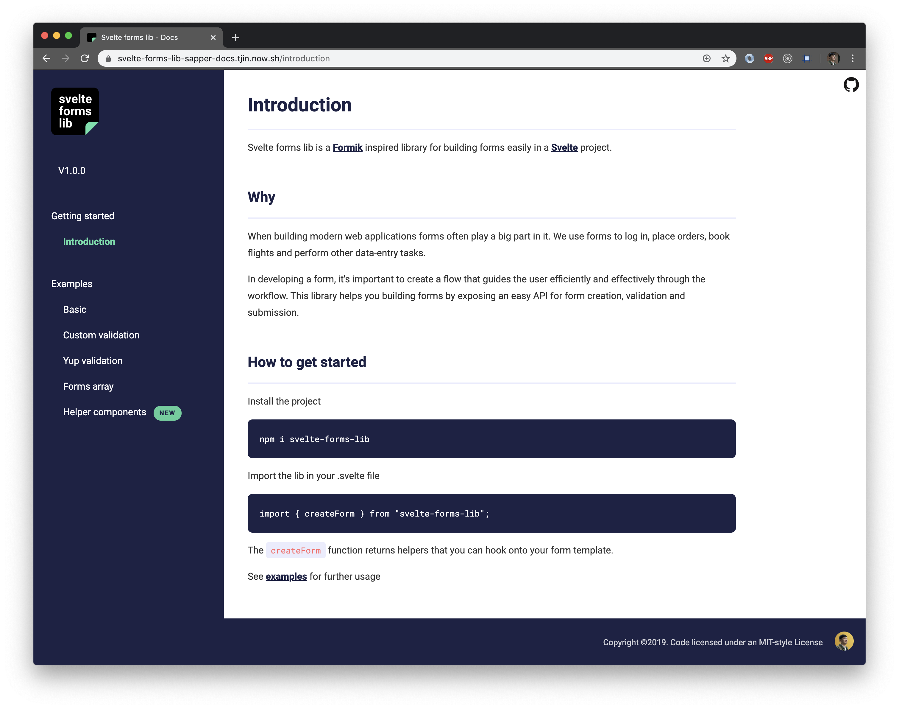

<a href="https://unsplash.com/@jakeblucker">
  
</a>

Building forms are the bread and butter of a typical business application. We use forms to log in, sign up,  adjust app settings, do data entry, and much much more. When tasked with building this using Svelte, I could not find a form library with an API I preferred. In an effort to change that I've ended up writing my own.

Let me present to you **svelte-forms-lib**: a small utility library for managing forms in Svelte.

<br/>


---

### Inspired by Formik

Coming from the React world I love working with [Formik](https://jaredpalmer.com/formik) to create forms. I especially like the declarative helper components that allows me write as little boilerplate as possible while handling all the form state and validation logic. And it's all well documented.

Following the example set by Formik, this library has a very similar API as Formik's.

The difference is svelte-forms-lib is, as you may have guessed, specific for [Svelte](https://svelte.dev) apps.

---

### Convenient helpers

The library provides the following helper components: `<Form/>`, `<Field/>` and `<ErrorMessage/>`. These help you minimize code needed to build a form.

A basic example using the helpers is the following login form:

```js
<script>
  import { Form, Field, ErrorMessage } from "svelte-forms-lib";
  import yup from "yup";

  const formProps = {
    initialValues: {
      username: "",
      password: ""
    },
    validationSchema: yup.object().shape({
      username: yup.string().required(),
      password: yup.string().required()
    }),
    onSubmit: values => {
      // make request to login endpoint
    }
  };
</script>

<h1>Login</h1>

<Form {...formProps}>
  <label>username</label>
  <Field name="username" />
  <ErrorMessage name="username" />

  <label>password</label>
  <Field name="password" type="password" />
  <ErrorMessage name="password" />

  <button type="submit">Login</button>
</Form>
```

The `Field` and `ErrorMessage` helpers make use of the [context API](https://svelte.dev/tutorial/context-api) to connect to the `Form` state in order to know how to update the form and when to display an error. The only requirement is to provide a `name` attribute so that they know which field to connect to. That's it.

---

### Validation with Yup

Form validation with svelte-forms-lib can be done in two ways:

- Use `validate` callback
- Use [Yup](https://github.com/jquense/yup)

#### Using callback

You can provide a `validate` callback in order to do form validation however you please. The callback is called with the form values whenever the form submits. You can use the form values to construct an errors object to return. Based on this svelte-forms-lib will update the errors state and potentially show error messages to the user. 

Visit [the docs](https://svelte-forms-lib-sapper-docs.tjin.now.sh/custom) for more.

#### Using Yup

The recommended way for form validation is using [Yup](https://github.com/jquense/yup). Yup is an object validator with a very intuitive API. Svelte forms lib integrates really well with it.

Validation works simply by providing a Yup schema:

```js
// inside <script> of .svelte component

const { form, errors, ...other } = createForm({
  // more options left out for brevity
  validationSchema: Yup.object().shape({
    name: yup
      .string()
      .required('please provide a username'),
    email: yup
      .string()
      .email()
      .required('please provide an email')
  })
});
```

The validation is run on two occasions:

- Validation is called **per field** when a field loses focus.
- Validation for **all fields** is called when the forms submits.

For the majority of cases this is all that is needed to setup validation. For the complete example go [here](https://svelte-forms-lib-sapper-docs.tjin.now.sh/yup).

---

### Visit the docs

Considering how important how important documentation is when devs evaluate a tool, considerable effort is put in creating a [documentation website](https://svelte-forms-lib-sapper-docs.tjin.now.sh).

<a href="https://svelte-forms-lib-sapper-docs.tjin.now.sh" target="_blank">
  
</a>

Here you'll find examples and code snippets you can easily copy and use to help you get started.

---

### Share your thoughts

I hope this library meets your needs when building forms in [Svelte](https://svelgte.dev). Please feel free to share your thoughts on the project and [create issues](https://github.com/tjinauyeung/svelte-forms-lib) when you encounter bugs or when you like to see a new feature.

I plan to actively develop and maintain the library for the coming period, so I'm very curious to hear what you think of it.
