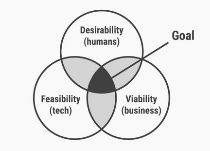
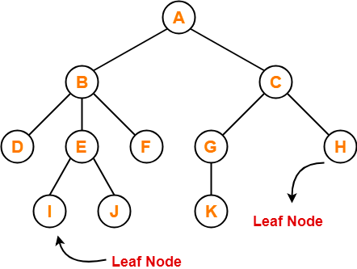
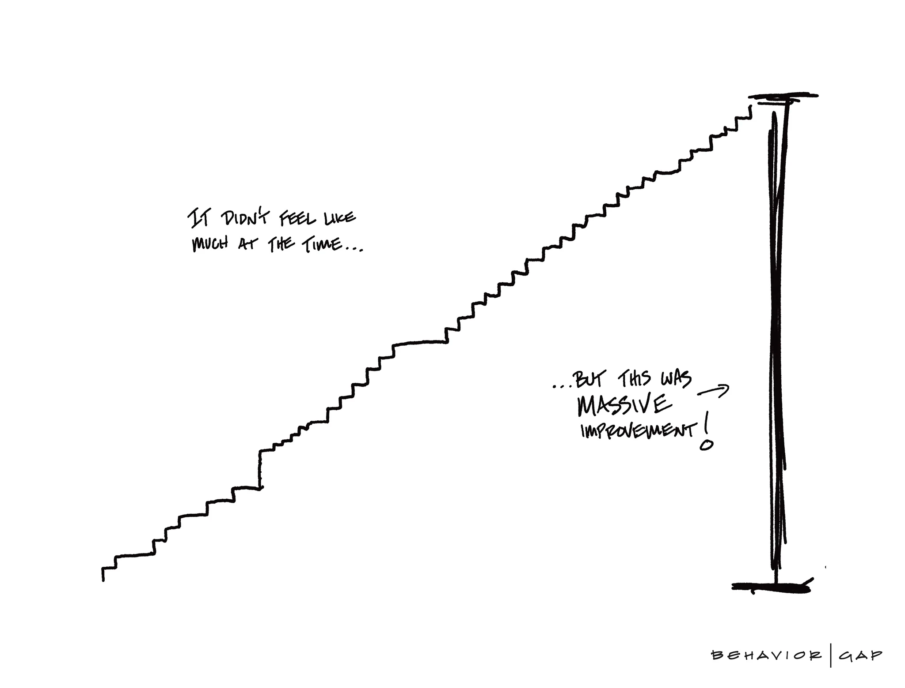
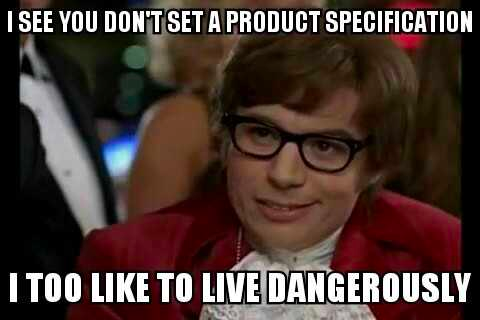

  <iframe width="800" height="450" style="margin: 20px -50px;" src="https://www.youtube.com/embed/r6jcqCm5C1Q" frameborder="0" allow="accelerometer; autoplay; encrypted-media; gyroscope; picture-in-picture" allowfullscreen></iframe>

Every year the caribou in the northern Americas embark on an epic journey in search for greener pastures. They head north, along well-trod annual routes towards their summer grazing grounds in the mighty Tundra. Some herds may travel more than 600 miles during this trip. The reason for this massive undertaking? The environment is spent, and can no longer accommodate them. In order to survive, they need to migrate to newer, nutrient-richer soils.

#### Migrating software

A parallel with software can be drawn. A similar cycle takes place in software where every _x_ amount of years there is need for a big rebuild. Old code has become brittle and hard to maintain. Labeled as legacy, it becomes more difficult to attract new engineers and / or to motivate existing ones. As such, just like within the animal kingdom, there is need here to move to the better and new. 

However, how does one embark on this journey riddled with uncertainty?

---

### The Problem

The problems arising from software entropy and the need for a rebuild can roughly be categorised under the following three topics:

- Rapid development
- Recruitment
- Retention

All three topics are likely to be negatively impacted as time goes by and the codebase ages.

#### Rapid development

Developing your application becomes slower and slower the more your code base grows. With continuous refactoring the decrease of speed can be delayed, however there comes a tipping point where the existing code becomes confusing and so brittle it necessitates a rebuild. 

On top of this, the technology you were relying on may not be actively maintained anymore, causing potential risks when stuff breaks.

Often this point will either come from the developers or the product owners becomes aware when features that should take two days suddenly take two months to build.

#### Recruitment

With new technologies becoming the industry standard every couple of years, engineers are searching for jobs that give them the opportunity to gain experience in these technologies. Buzz words like *"cutting edge"*, "*modern stack*", *"next generation"* are plastered on top of job descriptions and are highly effective to lure new talent. 

As your stack becomes outdated, it becomes more and more difficult to find new people who are excited to work with it.

#### Retention

Similarly, existing engineers will likely feel the pressure to learn new technologies and skills in order to keep up with the market demands. Therefore it is highly demotivating for them to work on legacy codebases, learning skills that are soon to be expired. Engineers flock to other companies that allow them to experiment and learn the most current tools of the trade. 

#### Solution

One way to solve these issues is to modernise your stack; migrate all existing code to a more modern technologies. A more up to date stack can make recruiting easier and better retain existing employees. Furthermore, it can enable new techniques and possibilities for your product moving forward. However, depending on the size of your app and your team you may not have the resources for such an undertaking. 

At [ING](https://developer.ing.com/openbanking/) I recently completed a migration of a front-end application with 58.252 LOC moving away from Polymer to a React based stack. In retrospect there were a few steps we've followed which has made this a successful migration, which can be summed up in this TLDR;

- **Buy in** — Convince stakeholders
- **Feasibility** — Test your approach
- **Increments** — Migrate incrementally while keeping the app working
- **Prioritise** — Plan which areas to tackle first
- **Focus** — Avoid distractions
- **Decoupling** — Decouple to avoid more future work
- **Testing** — Refactor with confidence

In the remainder of the article I'll discuss each step more in depth.

---

### Buy-in

  

The first step was to create a support base. We wanted to have support from all stakeholder, which meant getting the team, our PO and management on board with the idea. This was essential in order to avoid wasting time in an effort which risked being cancelled.

To gain support in an effective way, we first pointed the current problem*, then discussed a way forward and, finally, presented our plan to modernise and all of its benefits.

Lucky for us, we had a very accommodating Product Owner who was empathetic from the start and helped us convince the management layer of our plan as well. With the go ahead we quickly  started with small experiment; a feasibility test. 

**see section above — The Problem*

---

### Feasibility

  

In the [WBAA department](https://medium.com/wbaa/what-does-ing-wb-advanced-analytics-do-707a09175530) at [ING](https://developer.ing.com/openbanking/) there has been a shift to a more product focused development cycle. A big influencer is the framework of [design thinking](https://www.interaction-design.org/literature/topics/design-thinking), and part of it is the feasibility test. 

Applying this to our process meant that we needed to build a [proof of concept](https://lvivity.com/proof-of-concept-meaning) as soon as possible to test if our idea was technically achievable. Aside from measuring feasibility, the other major advantage is being able to identify potential obstacles early.

Several approaches were tried before deciding on the right one. This ensured the migration is technical feasible and that the best option is chosen. Also it resulted in more options and techniques which we mixed and matched in the final solution.

With positive result from the feasibility test we've decided on a core technique to enable the incremental migration. In our case this was having a React adapter wrapped inside of a Polymer element which is able render a React component. 

---

### Prioritise

Depending on the size of the application the migration can take a significant amount of time. Upon the start questions arise, where to start? I started by discussing this with the team to come up with a logical prioritisation of your efforts. Areas which are removed in the future could be skipped over, areas which have the most business value are higher priority. 

My personal preference is to start with the leaf nodes and work your way to the core. By leaf nodes I mean services, objects, components that are at the leafs of your application architecture. 

They have little dependencies, whereas other nodes may depend on them. Because of the lack of dependencies the complexity of refactoring is relatively low and work can be done in an isolated way, making it significantly easier.

  

However there is also something to be said of the other way around, by starting at the core. These are often the most crucial part of your application, having this migrated serves as a feasibility test and builds confidence. If the most important part of the application can be migrated without issue, then the chances of the migration succeeding is much higher.

Whichever approach you start with, agree with the team and work your way through the application is according to the plan.

---

### Increments

Probably the most important technical factor was to perform the migration in increments instead of one big bang rebuild. Being able to migrate incrementally and still have a working project made the strategy applicable to applications of any size, small or big. 

Looking at the evolution of development practises, the transition from [waterfall](https://en.wikipedia.org/wiki/Waterfall_model) practises to [agile](https://en.wikipedia.org/wiki/Agile_software_development) illustrates the benefits of working in increments. Being able to deploy the application regularly and observe potential bottlenecks and deal with them early, speeds up the development process as a whole and delivers business value along the way. We treated our migration in the same way.

The idea was to refactor small chunks of code from one technology to the other while still having everything working as before. When a small part had been migrated we could still deploy the app without issue. Any e2e tests should run successfully without fails. 

  

Working in increments helped in our conversation with deciding stakeholders. As there is no risk of having a broken app during the process, it minimises the risk and the weight of the decision. 

Another benefit was that the work of the migration can be spread out in alignment with our other targets. At any point, we could stop the migration and focus on delivering a new feature or perform a hot fix, without leaving the application in a broken state. 

As a side note I'll add that we wanted to keep the time spent in a hybrid state (with multiple technologies) as short as possible. It adds a lot of complexity and cognitive burden to the developers having to know different frameworks and switch contexts. Onboarding new recruits also take more time. Therefore, I advice to complete the migration as soon as you can.

Having incremental migration as an option is very powerful, if not, a requirement. It is important enough to spent significant research on this, and even develop additional infrastructure to support this if necessary. 

---

### Focus

**Avoid new features**

Keep your eyes on the prize. While it is tempting to add new features while migrating a specific section of the app. We have a tendency to improve what we see. I'm of the opinion that new features should be avoided. With them you pose considerable risk to the delaying of the migration and causing new bugs.

However, regarding cleaning up the code, [the boy scout rule](https://www.matheus.ro/2017/12/11/clean-code-boy-scout-rule/) should still apply; leave the camp place a bit cleaner than you found it.

**New features**

In case you have new features which need to be implemented asap, do you implement in the old code and then migrate into the new? This should be discussed in the prioritisation step. Modules containing near future work should be migrated first to avoid double work. Try minimise having to do things twice where possible.

  

  <small text-align="center">Avoid new features, but boy scout rule still applies</small>

---

### Decoupling

Most of us know the value of modular, [decoupled](https://en.wikipedia.org/wiki/Loose_coupling) software,  In the light of a tech migration picking new tools and technologies, that are decoupled and framework agnostic, prevent vendor lock in and enable easier path to migration in the future. 

Tove give a more concrete example, our legacy project was built around a [redux](https://redux.js.org/introduction/core-concepts), encapsulating much of the front-end business logic. This choice proved to be huge time saver, since it enabled us to move to a new framework, while preserving all the code within redux; reducing our  workload significantly while migrating.

My advice is to pick framework agnostic tools where you can, and write your application in a modular way, which will make refactoring and migrating stacks much simpler in the future.

---

### Testing

Finally, testing can help refactoring with confidence. There's a high chance that your code will break during a migration. It is subject to lots of change and especially in the beginning, the developers still need to familiarize themselves with the technology and the new workflow. In order to catch bugs during the migration and / or have your business crucial paths working as expected, it is beneficial to have end to end tests in place before you start.

> *"End-to-end testing is a technique used to test whether the flow of an application right from start to finish is behaving as expected. The purpose of performing end-to-end testing is to identify system dependencies and to ensure that the data integrity is maintained between various system components and systems."*

The benefits of having e2e testing is two-fold:

1. it reinforces the existing code and guards for breaking changes
2. it enables future migrations by providing safety and documentation

Thus, even when resources are scarce, you should identify business crucial flows and cover them with tests first in order to safely migrate. 

---

### Loss of specs

Hopefully, many of the discussed tips can help you tackle a migration. The biggest challenge, however, coming with a rebuild / migration of your application, lies within the specification of your app.

  

Legacy codebases tend to lived a full life of active development, accumulating many features, code changes and bug fixes along the way. Because of this, it is not easy to completely decipher the expected behaviour of the app. Carefully reading the code could help, but finding the exact intent is remains a challenge.

To solve this issue developers need to work closely together with the domain expert, testing the progress regularly and often, as not to miss any of the old functionality while moving towards a new stack.

---

### What's next?

As with perishable goods, code bases also have an expiration date. As software ages, existing code becomes more brittle. New features take longer to implement and it becomes harder to find the right people to do the work. 

At this point a big migration of the application to a new stack should be considered as a solution.

We've discussed 7 tips to take into account when starting this journey:

- **Buy in** — Convince stakeholders
- **Feasibility** — Test your approach
- **Increments** — Migrate incrementally while keeping the app working
- **Prioritise** — Plan which areas to tackle first
- **Focus** — Avoid distractions
- **Decoupling** — Decouple to avoid more future work
- **Testing** — Refactor with confidence

A major challenge during this process is the loss of specifications. Work closely together with a domain expert, testing the progress regularly and often in order to avoid losing functionality. 

Any thing to add to this list of points? Please send me an <a href="mailto:tjinauyeung@gmail.com">email</a> or twitter me at [@tjinauyeung](https://twitter.com/tjinauyeung). I'm curious on your thoughts!

In my next article I'd like to discuss in more detail how we used the discussed tips to migrate a Polymer based application to the newer React based tech stack. 

Stay tuned!
